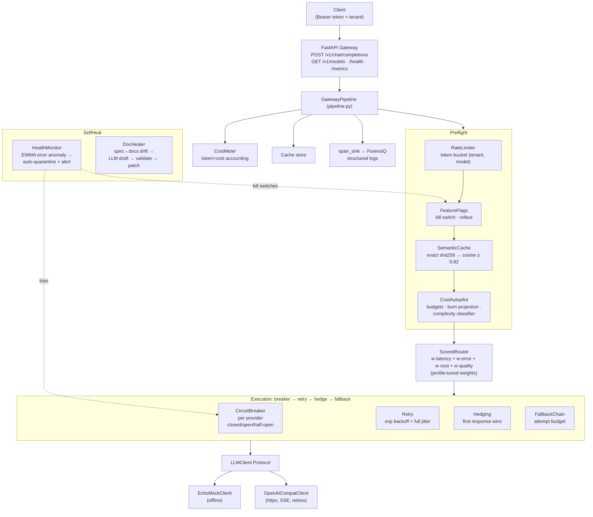

# AegisGate — Self-Healing LLM Gateway & Control Plane

AegisGate is a production-shaped **LLM gateway and control plane**: one process that sits between
your application and a dozen model providers and makes the fleet behave like a single reliable,
budgeted, observable LLM. It unifies the pieces most teams end up hand-rolling separately:

- **Self-healing routing** — composite-score model routing with per-provider circuit breakers,
  full-jitter retries, request hedging, and ordered fallback chains.
- **Rate limiting** — token buckets per `(tenant, model)` behind a swappable store Protocol.
- **Semantic caching** — a two-tier exact-hash + embedding-cosine cache with skip rules and
  hit/miss/token-savings metrics.
- **Cost autopilot** — per-tenant token/cost metering, soft/hard budgets, month-end burn
  projection, and a policy engine that *downgrades routing* under budget pressure.
- **Feature flags** — deterministic hash-bucket rollouts, sticky A/B assignment, per-model kill
  switches, and shadow mode (mirror, diff, never serve).
- **Self-healing** — an EWMA anomaly detector that auto-quarantines a failing provider (breaker +
  kill switches + alert payload), and a **DocHealer** that detects drift between an OpenAPI spec
  and your docs, then drafts and *validates* patches via an LLM.

Everything runs **fully offline**: the default `EchoMockClient` is deterministic, tests never touch
the network, and time is injected — the entire control plane is testable with a manual clock.

## 🟢 New to AI? Read this first

**The problem, in human terms.** Your product calls AI models the way a call centre phones out to experts. Today you ring one expert. When that expert is sick (provider outage), busy (rate limits), or too expensive, your whole product stalls — and at the end of the month nobody can tell you why the bill tripled.

**What this project does.** AegisGate is the switchboard between your product and every AI model. Every request flows through it, and it handles the boring-but-critical jobs automatically:

- **Never down:** if the primary model fails, it retries politely, tries the backup model, and can even "hedge" — phone a second model in parallel and take whoever answers first. A **circuit breaker** stops hammering a dead provider (like not redialling a switched-off phone) and gently probes it later to see if it recovered.
- **Never overcharged twice:** a **semantic cache** remembers past questions. If a new question means the same thing as an answered one, it replies instantly from memory — saving both latency and money. "Same meaning" is judged by embedding similarity, not exact string match.
- **Never over budget:** the **cost autopilot** meters every tenant's token usage like a smart electricity meter. Approaching budget? Easy tasks get routed to cheaper models automatically (and the README documents why the policy *lowers a maximum tier* rather than naively raising a minimum one — the intuitive version would burn money faster, not slower).
- **Never an experiment on everyone:** new models roll out via **feature flags** — 5% of users first, sticky per user, with a big red kill switch and a "shadow mode" that runs the new model quietly alongside and records how it *would* have answered, without ever showing it to a user.
- **Heals itself:** a health monitor watches error rates (EWMA smoothing, so one blip ≠ panic) and quarantines failing providers; a **DocHealer** bot notices when the API documentation drifts from the actual API and drafts validated doc patches.

**Measured outcomes:** 91 automated tests pass offline in ~1.5 seconds — including the full gateway request lifecycle (streaming, auth, rate-limit rejections), circuit-breaker open→half-open→recovery transitions, cache hits on semantically-identical questions, autopilot downgrades under simulated budget burn, deterministic 5%-rollouts, and the doc-healer detecting and patching real drift. Every stage emits a span for the ForensiQ forensics tool, so when something goes wrong at 2am, the evidence is already on disk.

## Architecture



## Quickstart

```bash
pip install -e .
cp .env.example .env          # defaults run fully offline (LLM_MODE=echo)

# Run the gateway
python -m aegisgate.gateway.app &
curl -s localhost:8000/v1/chat/completions \
  -H "Authorization: Bearer sk-demo" -H "Content-Type: application/json" \
  -d '{"model":"gpt-4o","messages":[{"role":"user","content":"hi"}]}'
# → served_by may differ from the requested model: the router picked the
#   best-scoring healthy model for the request profile.

# Tests + lint
python -m pytest -q
python -m ruff check src tests
```

Point `AEGISGATE_LLM_MODE=openai` at any OpenAI-compatible server (OpenAI, vLLM, Together,
Ollama's shim) with `AEGISGATE_OPENAI_BASE_URL` + `AEGISGATE_OPENAI_API_KEY` to proxy real traffic.

## Module map

```
src/aegisgate/
├── clock.py                  Clock Protocol + SystemClock/ManualClock (injected everywhere)
├── config.py                 pydantic-settings (AEGISGATE_* env vars, .env)
├── pipeline.py               orchestration + spans/logs instrumentation
├── ratelimit.py              token bucket, RateLimitStore Protocol, per (tenant, model)
├── flags.py                  rollouts, sticky A/B, kill switches, shadow, JSON persistence
├── llm/
│   ├── base.py               LLMClient Protocol, ChatRequest/Response/Chunk, LLMError taxonomy
│   ├── echo.py               deterministic offline client
│   └── openai_compat.py      httpx client: SSE streaming, retries, error mapping
├── router/
│   ├── registry.py           ModelRegistry (validated YAML catalog)
│   ├── models.yaml           12 models / 9 providers, prices, tiers, capabilities
│   ├── scoring.py            composite score, profile weights, EWMA tracker (latency, error, p95)
│   ├── breaker.py            per-provider circuit breaker (closed/open/half-open, probe quota)
│   ├── retry.py              exponential backoff + full jitter, retryability via LLMError
│   ├── hedging.py            race primary vs shadow, cancel loser
│   └── fallback.py           ordered candidates, attempt budget, served-by audit
├── cache/semantic.py         two-tier cache: exact hash + cosine, LRU+TTL, skip rules, metrics
├── cost/
│   ├── meter.py              per-tenant token/cost ledger, budgets, month-end projection
│   ├── autopilot.py          complexity classifier + policy engine (tier downgrade under burn)
│   └── report.py             monthly JSON + markdown cost report
├── selfheal/
│   ├── monitor.py            EWMA anomaly detection → auto-quarantine → alert payload
│   └── docbot.py             DocHealer: spec↔docs drift → LLM draft → validation → diff bundle
└── gateway/
    ├── app.py                FastAPI: OpenAI-compatible API, Bearer→tenant, SSE
    └── metrics.py            Prometheus text-format counters/histograms/gauges
```

## Design decisions (and their trade-offs)

**Token bucket over fixed-window rate limiting.** A fixed window lets a client spend 2x the limit
across a boundary and punishes legitimate bursts with a cliff. A token bucket enforces the same
long-run rate while allowing bounded bursts — the semantics you actually want in front of APIs.
Cost: buckets carry mutable state per key, so horizontal scale needs a shared store (hence
`RateLimitStore` as a Protocol with Redis as the intended prod implementation).

**EWMA over raw latency samples.** Raw min/avg over a window is either jittery (small windows) or
stale (large ones). An EWMA gives O(1) memory, smooths single outliers, and still reacts within a
few samples (alpha=0.3 reacts to a sustained shift in ~5 samples). Trade-off: a single catastrophic
outlier is under-weighted — which is exactly what hedging and the breaker are for; each mechanism
covers a different failure shape.

**Composite score with min-max normalization.** Latency EMA and blended price (75/25 input/output
mix) are normalized across the *candidate set*, so the router compares models relative to what is
actually routable right now rather than against absolute constants. Request profiles
(cost/balanced/latency/quality) only change weights, not code paths — new profiles are a dict entry.
Trade-off: min-max makes scores relative; adding one ultra-cheap model reshuffles normalization.
That is acceptable because re-ranking is cheap and the fallback chain bounds the damage.

**Exact + semantic two-tier cache.** Tier 1 is a sha256 over a canonicalized request (lowercased,
whitespace-collapsed messages + model family + tool names): zero false positives, O(1). Tier 2
catches paraphrases via cosine similarity over embeddings at a conservative 0.92 threshold. The
conservative threshold is deliberate — a wrong cache hit silently corrupts answers, while a miss
just costs money. Skip rules encode *semantic* correctness, not just policy: temperature > 0.7 and
tool-calling requests bypass the cache because replay would be wrong, not merely stale. LRU+TTL
bounds memory. The embedder is a Protocol; the bundled deterministic hashing embedder keeps tests
offline, and a real embedding model slots in without touching the cache.

**Full-jitter exponential backoff.** Naive backoff synchronizes retries into waves after an outage
blip ("thundering herd"). Full jitter (sleep uniform(0, backoff)) desynchronizes clients at the cost
of occasionally retrying sooner than optimal — empirically the better trade. Retriability is a
property of the error, not the caller: 429/5xx/timeouts retry, 4xx content errors fail fast because
retrying them is pure waste.

**Circuit breaker per provider, not per model.** Outages are usually provider-shaped (auth, quota,
region) and one shared state stops the gateway from burning each of a dead provider's models in
sequence during fallback. Half-open admits a *quota* of probes (2 by default) rather than one, so a
flappy provider doesn't need N recovery cycles. Trade-off: one bad model can open the breaker for a
provider's healthy models; the health monitor's quarantine event payload names the models so
operators can tune the threshold.

**Hedging gated on hedge_delay AND p95.** Duplicates double your token bill if fired eagerly.
AegisGate fires a hedge only when the primary is still silent after `hedge_delay_s` *and* its
observed p95 exceeds the threshold — hedging targets tail latency on known-slow routes, not every
request. First response wins; the loser is cancelled, not leaked.

**Autopilot downgrades by tier ceiling, not price guesses.** The registry assigns each model a
quality_tier (1–5, 5 = frontier). Under projected month-end burn ≥ 80% of the hard budget, the
autopilot drops the allowed max tier by one (non-premium traffic only) and easy tasks get an output
price cap. The brief's "raise the minimum quality_tier requirement" reads as an upgrade under the
registry's convention — routing to *better* models during a budget crisis would accelerate burn —
so the implemented semantic is "degrade routing by one tier" via a max-tier ceiling. Easy/hard
complexity classification is a deliberate heuristic (length, code fences, structured-output cues):
it is inspectable, deterministic, and fast; a trained classifier can replace it behind the same
method signature.

**Shadow mode never serves.** Shadow traffic mirrors to a candidate model, records a diff, and is
discarded from the user path — the safest way to evaluate a new model against real traffic. The
diff store is in-memory; the flag state (rollouts, kill switches, shadow pairs) persists to JSON
atomically (tmp+rename).

**DocHealer validates before adopting.** Docs drift is structural (endpoints added/removed/params
changed), detected by diffing parsed OpenAPI against parsed doc sections. The LLM *drafts* the
patch, but a draft section is adopted only if it exactly matches the live spec and passes lint
(headings, link targets) plus example replay (HTTP examples must hit real endpoints with real
params). Anything else falls back to a deterministic template rendered from the spec itself. The
result: running the healer can never make docs worse — and the offline demo works with EchoMock.

**Everything is offline by construction.** LLM access sits behind one Protocol with a deterministic
echo implementation; time sits behind a `Clock`; rate-limit storage sits behind a `Protocol`. The
pytest suite runs the *real* pipeline and the *real* FastAPI app over ASGI — no network, no keys,
no sleeps.

## Configuration reference

| Env var | Default | Meaning |
| --- | --- | --- |
| `AEGISGATE_LLM_MODE` | `echo` | `echo` (offline) or `openai` (OpenAI-compatible) |
| `AEGISGATE_OPENAI_BASE_URL` | `https://api.openai.com/v1` | Upstream endpoint |
| `AEGISGATE_OPENAI_API_KEY` | — | Upstream key |
| `AEGISGATE_TENANT_TOKENS` | — | `token:tenant` pairs (comma-separated); empty = token IS tenant |
| `AEGISGATE_RATE_LIMIT_CAPACITY` / `_REFILL_PER_SEC` | 10 / 2 | Token bucket per (tenant, model) |
| `AEGISGATE_BREAKER_FAILURE_THRESHOLD` | 5 | Failures before opening |
| `AEGISGATE_BREAKER_RECOVERY_TIMEOUT_S` | 30 | Open → half-open delay |
| `AEGISGATE_BREAKER_HALF_OPEN_PROBES` | 2 | Concurrent probes allowed in half-open |
| `AEGISGATE_RETRY_MAX_RETRIES` | 2 | Retries per model attempt |
| `AEGISGATE_HEDGE_DELAY_S` | 0.25 | Silence before a shadow fires |
| `AEGISGATE_HEDGE_P95_THRESHOLD_MS` | 1500 | p95 required to arm hedging |
| `AEGISGATE_CACHE_TTL_S` / `_MAX_ENTRIES` / `_SEMANTIC_THRESHOLD` | 3600 / 256 / 0.92 | Cache bounds |
| `AEGISGATE_DAILY_SOFT/HARD`, `AEGISGATE_MONTHLY_SOFT/HARD` | 5/10/50/100 | Per-tenant budgets (USD) |
| `AEGISGATE_FLAGS_PATH` | — | JSON persistence path for flags |
| `AEGISGATE_REGISTRY_PATH` | bundled | Custom model registry YAML |

## Testing

`python -m pytest -q` — fully offline. The suite covers: cheapest-healthy-model routing under the
cost profile; breaker open → half-open probe quota → close/reopen; token-bucket 429 + Retry-After;
exact and semantic cache hits; temperature/tool skip rules; TTL expiry and LRU eviction; autopilot
tier downgrade under simulated budget pressure (ManualClock); deterministic rollouts and kill
switches; hedging winner selection and loser cancellation; retry jitter bounds and 4xx fail-fast;
OpenAI-compatible client against `httpx.MockTransport` (SSE parse, retry-on-500); end-to-end
DocHealer drift → patch; health monitor auto-quarantine; and the full gateway lifecycle over ASGI
(non-stream, SSE stream, models, health, metrics, 401/429 paths).

## Production notes

- **Scaling:** the gateway is stateless except rate-limit buckets, cache, meters and flags. For
  multi-replica deployment, move `RateLimitStore` to Redis (Protocol already defined), back the
  semantic cache with a shared vector index, and ship meter records to your billing sink. Flag
  state is a small JSON blob — put it in object storage or a config service.
- **Multi-tenant isolation:** tenants are bearer tokens; every accounting surface (buckets,
  budgets, meters, metrics) keys on tenant id. Budget hard-stop returns 429 with a trace id.
  For stronger isolation, run one pipeline per tenant class with separate registries.
- **Security:** the gateway never logs message bodies by default (structured logs carry ids,
  counts, and model names); provider keys live only in the OpenAICompatClient. Put the service
  behind your normal ingress TLS; the app itself is plain HTTP.
- **Observability:** `/metrics` exposes request counters with tenant/model/status labels, a
  request-latency histogram, cache hit/miss and savings counters, breaker-state gauges and cost
  gauges. Every pipeline stage also emits a ForensiQ-compatible span dict to a pluggable
  `span_sink` — wire it to your tracer to get request-scoped forensic timelines for free.

## Honest limitations

- Prices/quality tiers are static YAML — no live pricing feed or quality evals; tier assignment is
  editorial judgment, not benchmarked.
- The bundled embedder is a hashing bag-of-tokens: semantic hits work for lexical overlap, not
  deep paraphrase. Bring a real embedding model for production.
- In-memory single-process state (cache, buckets, meters, shadow diffs) — correct semantics, but
  per-replica only; cross-replica correctness needs the store seams filled.
- Streaming path disables retry/hedge (partial outputs can't be replayed safely); a true
  streaming hedge would need idempotent upstreams or output-diffing.
- DocHealer's docs parser expects `METHOD /path` headings and backticked params — a convention,
  not a universal docs format.
- No request queuing/priority lanes, no response streaming transform policies, no audit log
  persistence (spans/logs are per-request and sink-dispatched).

## Roadmap

- Redis-backed rate-limit store + distributed cache; meter export to a billing sink.
- Real embedding service behind the cache Protocol; embedding-versioned cache namespaces.
- Trained complexity classifier replacing the heuristic (same interface).
- Latency-budget-aware routing (deadline propagation from clients into hedge/timeout decisions).
- Multi-region provider health federation; quarantines published to peer gateways.
- ForensiQ integration: span export in OTLP format, replay from span streams.
